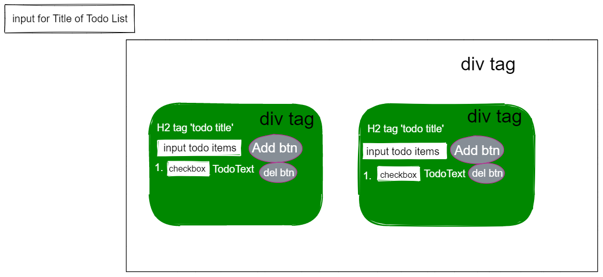

# JavaScript Todo List using Classes

...

---

## User Story Dependencies

[Story Dependency Diagram](https://excalidraw.com/)

---

## WIREFRAME



---

## 0.Setup

1. Created repo from the template
1. Activated Live page
1. Invited collaborators
1. Created group issue
1. ...

---

## 1. User story : Initialize Application

**As a user I want to see the initial page when I load the site**

- \_Given [context] when [a specific action is performed] then [a set of consequences should occur]\_\_
- ...

### REPO

- This user story is developed on branch `Initialize Application`.
- This branch is merged to `master` branch after completion.

### Task A: HTML

- Template was ready to use

### Task B: CSS

- Copy-past from last project

### Task ...

---

## 2. User story : Create TodoList Container

**As a user I would like be able to add a title(s) for my todo list(s)**

**Assigned to Sayed Kazimi**

- \_Given [context] when [a specific action is performed] then [a set of consequences should occur]\_\_
- ...

### REPO

- This user story is developed on branch `TodoList-container`.
- This branch is merged to `master` branch after completion.

### Task A: CSS

```css
#list-name-input {
	padding: 0.7em;
	font-size: 1em;
	font-weight: bold;
}
input[name="inputItems"] {
	padding: 0.5em;
	font-size: 0.8em;
}
/*
    todo list container
*/
div#lists {
	display: grid;
	grid-template-columns: auto auto auto;
	align-content: center;
	justify-content: space-around;
}
/*
    media query for todo list container
 */
@media (max-width: 610px) and (min-width: 100px) {
	div#lists {
		display: grid;
		grid-template-columns: auto;
		align-content: center;
		justify-content: space-around;
	}
}
@media (max-width: 810px) and (min-width: 610px) {
	div#lists {
		display: grid;
		grid-template-columns: auto auto;
		align-content: center;
		justify-content: space-around;
	}
}
/*
    end media query for todo list container
 */

#list-box {
	position: relative;
	z-index: 9;
	top: 60px;
	width: 280px;
	color: white;
	box-sizing: border-box;
	background: rgb(243, 7, 192);
	border-radius: 1em;
	padding: 1rem;
	margin: 1rem;
}

#list-box button {
	outline: none;
	background: rgb(199, 20, 154);
	border-radius: 1em;
	border: 1px solid #b33092;
	color: #fff;
	font-weight: bold;
	padding: 0.7em;
	transition: 0.13s ease-in-out;
	cursor: pointer;
	text-align: center;
}
```

### Task B: HTML

placeholder="Add Title for Todo List"

### Task C: JavaScript

```js

render() {
// Added codes inside this function

let listBox = document.createElement("div");
listBox.id = "list-box";
let todoTitle = document.createElement("h2");
todoTitle.textContent = this.state.name;
let inputItems = document.createElement("input");
inputItems.type = "text";
inputItems.name = "inputItems";
inputItems.placeholder = "Enter Tasks To Do";

const addItems = document.createElement("button");
addItems.textContent = "Add";

listBox.appendChild(todoTitle);
listBox.appendChild(inputItems);
listBox.appendChild(addItems);

return listBox;
}
```

### Task D: Development Strategy

- Wrote what I did in this branch(part of the project)

### Task E: Issues

- Created an issue for this user story

### Tast F: PR

- Create a PR and assigned reviewers **Razvan, Yulia**

---

## 3. User story : Add tasks in the list

**As a user I should be able to see a text box and add button so that I can be able to add the tasks for any todo list of choice**

**Assigned to Razvan**

- \_Given [context] when [a specific action is performed] then [a set of consequences should occur]\_\_
- ...

### REPO

- This user story is developed on branch `add-task`.
- This branch is merged to `master` branch after completion.

### Task A

### Task B

### Task ...

---

## 4. User story : MARK/UNMARK - add check box to update the task

**As a user I should be able to see the added items in todo list**

**Assigned to Anna**

> note: finished as part of `final-touch`

- \_Given [context] when [a specific action is performed] then [a set of consequences should occur]\_\_
- ...

### REPO

- This user story is developed on branch `MARK-UNMARK`.
- This branch is merged to `master` branch after completion.

### Task A

### Task B

### Task C ...

---

## 5. User story : DELETE task

**As a user I should be able to delete the tasks that I want**

**Assigned to Yulia**

### REPO

- This user story is developed on branch `delete-task`.
- This branch is merged to `master` branch after completion.

### Created a deleteItems method

---

## 6. Finishing Touches

- Validate code to check for any last mistakes

**Assigned to Sayed**

- \_Given [context] when [a specific action is performed] then [a set of consequences should occur]\_\_
- ...

### REPO

- This user story is developed on branch `final-touch`.
- This branch is merged to `master` branch after completion.

### Task A: JavaScript

1. edited the following code in the function `displayItems`

```js
if (todo.completed === true) {
	checkItem.checked = true;
} else {
	checkItem.checked = false;
}
```

2. Created a new function `toggleComplete`

```js
	toggleComplete(todo) {
		debugger;
		todo.completed = !todo.completed;
		this.displayItems();
	}
```

3. fixed a simple mistake inside of the class `List`

### Task B: CSS

- Added background for the web page

### Task C: wireframe

- Created a simple wireframe and added to the development-strategy

### Task D: Development Strategy

- Wrote the final part of the development strategy

### Task E: PR

- Created PR and assigned reviewers

### Task F: issue

- Created issue for this part of the project

### Task G:

- Validate HTML, CSS, ...

---
